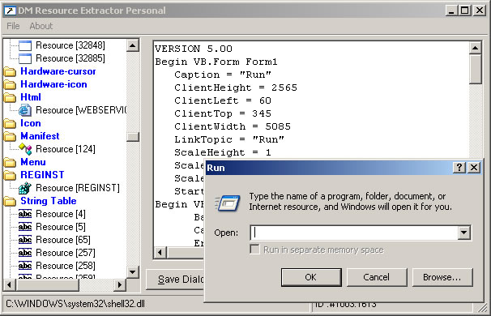



## DM Resource Viewer / Extract

### Description

Well I am back agian with a new update.

Some of you may remmber DM Bitmap Extractor well if you liked that you will also find this usfull. You can.

View and Extract AVI,REG Files, Bitmaps, Icons, Cursots, Menus, Dialogs,Text files, HTML,String Tables and more Hope you like this update.

Please Vote.
 
### More Info
 

             |
---                |---
**Submitted On**   |2001-11-29 10:29:28
**By**             |[dreamvb](https://github.com/Planet-Source-Code/PSCIndex/blob/master/ByAuthor/dreamvb.md)
**Level**          |Intermediate
**User Rating**    |5.0 (170 globes from 34 users)
**Compatibility**  |VB 6\.0
**Category**       |[Complete Applications](https://github.com/Planet-Source-Code/PSCIndex/blob/master/ByCategory/complete-applications__1-27.md)
**World**          |[Visual Basic](https://github.com/Planet-Source-Code/PSCIndex/blob/master/ByWorld/visual-basic.md)
**Archive File**   |[DM\_Resourc1827321292004\.zip](https://github.com/Planet-Source-Code/dreamvb-dm-resource-viewer-extract__1-57629/archive/master.zip)

